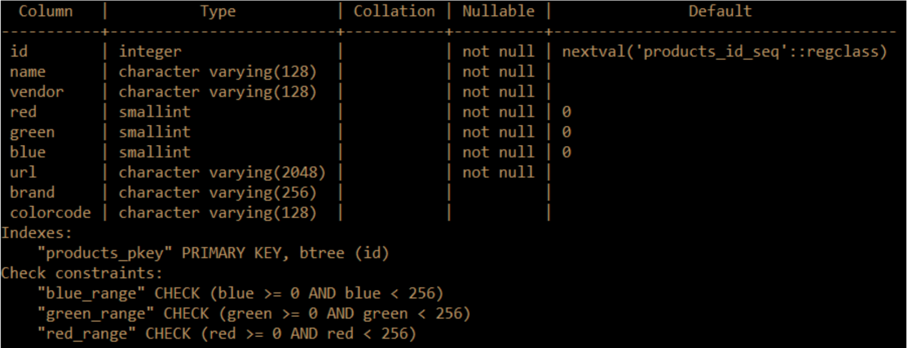

# Installation Instructions
For standard users no installation is required as the application is web hosted and accessible via the domain matchr.makup. For administrators that want to get the server up and running they need to follow the following instructions:

## Platform Set-Up
- Depending on the scope that you intend to host this app for, the platform can be as simple as a linux capable desktop environment or as robust remote hosting service such as EC2
- Whatever the platform may be, it needs to be accessible via HTTP port 80 (if publicly hosting), and root permissions must be available.
- In the linux environment one must first install the necessary conda environment:
```
wget https://repo.anaconda.com/miniconda/Miniconda3-py310_23.1.0-1-Linux-x86_64.sh
```
```
chmod -v +x Miniconda*.sh
```
```
./Miniconda3-py310_23.1.0-1-Linux-x86_64.sh
```
- With conda installed, you now need to download and unzip the release.
- With the release in place, in the main directory run:
```
conda env create -n matchr --file environment.yml
```
```
conda activate matchr
```
- Finally, adjust the makeupMatcher/makeupMatcher/settings.py to add your hostname source addresses to the ALLOWED_HOSTS variable.

## Running the Server
- Now that you’re ready to run the server, you can either run it locally for internal connection, or you can run it publicly hosted.
- To run locally:
  - In makeupMatcher, with the conda environment active, run:
```
python manage.py runserver
```
  - This will make the application locally available at 127.0.0.1:8000
- To run remote
  - Switch to root with sudo -s
  - In makeupMatcher, with the conda environment active in root, run:
```
python manage.py runserver 0:80
```
  - This will make the application publicly available at your device's public IP address, and any domain names attached to it.

## Expanding the Database
- The database requires fields to be filled as according to the schema specified above.
- Assuming your own database is attached to the service, the following fields and types are required as specified below on a table titled “products”:

- This will function with the Django models employed by the repository.
- To expand this database, I’d recommend collecting the cosmetics products from the vendor in question into a tab separated variable listing (TSV), following the database schema. Such a file could be imported to postgres as follows:
```
\copy products(name, vendor, red, green, blue, url, brand, colorcode, price) from '<PATH TO TSV>' with delimiter E'\t' csv;
```
- With this the attached database will automatically expand.
- Database commands may vary if a different platform is used.


# Notes

On Windows use **Command Prompt** when working with **conda**

# Django

## Start Server
```
cd makeupMatcher
```
```
conda activate matchr
```
```
python manage.py runserver
```

# Conda

## First Time Setup
```
conda env create -n matchr --file environment.yml
```
```
conda activate matchr
```

## Import Environment
```
conda deactivate
```
```
conda env remove -n matchr
```
```
conda env create -f environment.yml
```
```
conda activate matchr
```

## Add a Package

If you need to add a package to the environment run:
```
conda install -n matchr PACKAGE_NAME
```

Then open **environment.yml** and add PACKAGE_NAME alphabetically under the **dependencies** header  

## Activate Environment
```
conda activate matchr
```

## Deactivate Environment
```
conda deactivate
```
